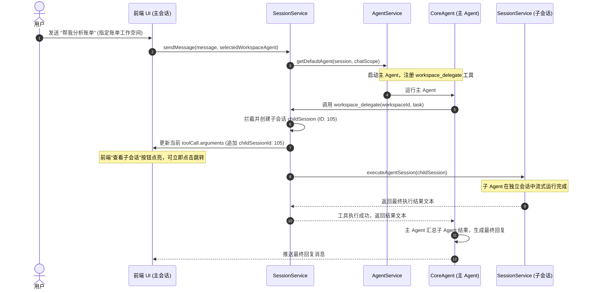

# 子 Agent 委派重构与优化技术设计

## 1. 架构概览

重构前的架构是“硬拦截”模式：在 `SessionService.sendMessage` 接收到消息时，如果判定为委派任务，直接拦截并不启动主 Agent，通过 mock 数据伪造一个 toolCall 写入历史。这种方案导致主 Agent 无法感知委派，且无法处理后续的多轮对话与回调。

重构后的架构是“真正的 Tool 调用”模式：
1. **主 Agent 运行**：不论是否指定工作空间，均正常启动主 Agent。
2. **工具注册**：在 Conversation 作用域下，为主 Agent 注册 `workspace_delegate` 真实工具。
3. **参数传递与复用**：LLM 可以自主或在引导下调用该工具，并传递 `workspaceId`、`task` 和可选的 `sessionId`。
4. **子会话执行**：工具在执行时唤起 `SessionService` 运行子 Agent，并将子 Agent 的最终回复作为工具结果返回。
5. **UI 渐进式感知**：工具执行一开始即创建子会话，主进程通过修改当前正在执行的 toolCall 参数（混入 `childSessionId`）并推送更新事件，让前端能立刻感知并提供跳转按钮。



---

## 2. 详细设计

### 2.1 避开循环依赖 (Circular Dependency)

`SessionService` 需要调用 `AgentService` 启动主 Agent；而主 Agent 运行 `workspace_delegate` 时又需要调用 `SessionService` 来执行子会话。为了避免 class 级别的循环注入，我们使用 **运行时回调注册模式**：

1. 在 `AgentService` 中定义一个接口或注册方法：
   ```typescript
   export type WorkspaceDelegateHandler = (params: {
     workspaceId: number;
     task: string;
     sessionId?: number;
     toolCallId: string;
   }) => Promise<{
     content: Array<{ type: "text"; text: string }>;
     details: {
       childSessionId: number;
       workspaceId: number;
       workspaceName: string;
       agentName: string;
       status: "completed" | "stopped" | "failed";
       summary: string;
     };
   }>;

   @Injectable()
   export class AgentService {
     private workspaceDelegateHandler?: WorkspaceDelegateHandler;

     registerWorkspaceDelegateHandler(handler: WorkspaceDelegateHandler) {
       this.workspaceDelegateHandler = handler;
     }
   }
   ```
2. 在 `SessionService` 初始化时（例如构造函数中），将自身的执行逻辑注册到 `AgentService`：
   ```typescript
   @Injectable()
   export class SessionService {
     constructor(
       private readonly agentService: AgentService,
       // ...
     ) {
       this.agentService.registerWorkspaceDelegateHandler((params) =>
         this.runWorkspaceDelegate(params)
       );
     }
   }
   ```

### 2.2 `workspace_delegate` 工具定义

工具将在 `app/work/src/main/service/tools/workspace-delegate.tool.ts` 中创建：
```typescript
import { Type } from "@sinclair/typebox";
import { createTool } from "@willow/core";

export const workspaceDelegateSchema = Type.Object({
  workspaceId: Type.Number({ description: "目标工作空间的 ID" }),
  task: Type.String({ description: "指派给子 Agent 的任务内容" }),
  sessionId: Type.Optional(Type.Number({ description: "要复用或追加对话的子会话 ID (可选)" })),
});

export function createWorkspaceDelegateTool(
  parentSessionId: number,
  handler: (params: {
    workspaceId: number;
    task: string;
    sessionId?: number;
    toolCallId: string;
  }) => Promise<any>
) {
  return createTool({
    name: "workspace_delegate",
    label: "委派工作空间任务",
    description: "将具体开发或分析任务委派给对应工作空间下的子 Agent。执行时间可能较长。执行结果会回调返回。",
    parameters: workspaceDelegateSchema,
    async execute(toolCallId, params, signal) {
      return handler({
        ...params,
        toolCallId,
      });
    },
  });
}
```

### 2.3 `SessionService` 核心执行流程

重构后的 `runWorkspaceDelegate` 实现逻辑：
```typescript
async runWorkspaceDelegate(params: {
  workspaceId: number;
  task: string;
  sessionId?: number;
  toolCallId: string;
  parentSessionId: number;
  parentChatScope: "conversation" | "workspace";
}): Promise<any> {
  const { workspaceId, task, sessionId, toolCallId, parentSessionId, parentChatScope } = params;

  // 1. 解析目标工作空间与 Agent 名称
  const workspace = await this.workspaceService.getWorkspaceInfo(workspaceId);
  if (!workspace) throw new Error(`未找到工作空间: ${workspaceId}`);
  const agentName = await this.resolveAgentNameForWorkspace(workspaceId);

  // 2. 复用会话或创建新会话
  let childSession: Session;
  if (sessionId) {
    const existing = await this.sessionDao.findById(sessionId);
    if (existing && existing.workspaceId === workspaceId) {
      childSession = existing;
    } else {
      childSession = await this.createSession(workspaceId);
    }
  } else {
    childSession = await this.createSession(workspaceId);
  }

  // 3. 将会话标题设置为任务内容的缩影
  void this.createSessionTitle(childSession.id, task);

  // 4. 实时动态注入 childSessionId 到主会话的 toolCall 运行参数中，以供前端渲染
  const activeStream = this.activeSessionStreams.get(parentSessionId);
  if (activeStream) {
    for (const msg of activeStream.messages) {
      if (msg.role === "assistant" && Array.isArray(msg.content)) {
        const toolCall = msg.content.find((c) => c.type === "toolCall" && c.id === toolCallId);
        if (toolCall) {
          toolCall.arguments = {
            ...toolCall.arguments,
            childSessionId: childSession.id,
          };
          break;
        }
      }
    }
    // 发送消息更新事件，使前端在运行一开始就能获得 childSessionId 并显示"查看子会话"按钮
    this.eventService.sendEvent("UPDATE_MESSAGE", {
      sessionId: parentSessionId,
      groupId: "0",
      chatScope: parentChatScope,
      event: {
        type: "message_update",
        messages: activeStream.messages,
      },
    });
  }

  // 5. 登记中止控制器，供前端 Stop 按钮调用
  const abortController = new AbortController();
  this.delegatedSessionRuns.set(parentSessionId, {
    childSessionId: childSession.id,
    abort: () => {
      this.stopSessionStream(childSession.id);
      abortController.abort();
    },
  });

  try {
    // 6. 运行子 Agent 会话，将审批流转发至父会话中
    const childResult = await this.executeAgentSession({
      session: childSession,
      chatScope: "workspace",
      promptInput: task,
      // 使用子 Agent 默认或当前的 model 规则
      forwardApprovalsToParentSessionId: parentSessionId,
    });

    const summaryText = childResult?.text || "未返回有效结果";

    return {
      content: [
        {
          type: "text",
          text: `委派执行已完成。子会话 ID: ${childSession.id}。\n执行结果如下：\n${summaryText}`,
        },
      ],
      details: {
        childSessionId: childSession.id,
        workspaceId,
        workspaceName: workspace.name,
        agentName,
        status: "completed",
        summary: summaryText,
      },
    };
  } catch (err: any) {
    return {
      content: [
        {
          type: "text",
          text: `委派执行失败。子会话 ID: ${childSession.id}。\n错误详情：${err.message}`,
        },
      ],
      details: {
        childSessionId: childSession.id,
        workspaceId,
        workspaceName: workspace.name,
        agentName,
        status: "failed",
        summary: err.message,
      },
      isError: true,
    };
  } finally {
    this.delegatedSessionRuns.delete(parentSessionId);
  }
}
```

### 2.4 用户明确选定工作空间时的策略

在 `AgentService.getDefaultAgent` 中，如果用户在前端下拉框明确指定了 `selectedWorkspaceAgent`，则触发以下处理：
- 解析出 `targetWorkspaceId`。
- 在系统提示词最后追加一条强指令（`systemPromptOverrides`）：
  > [!IMPORTANT]
  > 用户指定了目标工作空间 Agent（ID: ${targetWorkspaceId}）。你必须调用 `workspace_delegate` 工具，将用户的提问指派给该工作空间。禁止直接回答或使用其他工具。

从而确保在这种情况下百分之百走工具调用路径。

---

## 3. UI 重构设计 (WorkspaceDelegateToolRenderer.vue)

### 3.1 问题与合规调整

- **当前问题**：整个卡片详细内容和"查看子会话"按钮写在 `#summary` 插槽中。`ToolCallCard` 内部是用 `CollapsibleTrigger`（本质是 `<button>`）包裹 `#summary` 插槽。这形成了 `button` 嵌套 `button` 的违法 HTML 结构。它导致：
  1. 点击内部的“查看子会话”按钮会触发表单冒泡导致卡片折叠/展开，用户体验极差。
  2. 卡片无法正常展开/折叠，因为 CollapsibleContent 被留空。
  3. 显示的 markdown 是 raw pre 格式，没有排版，极不美观。

- **合规改造方案**：
  1. 折叠部分仅保留极简信息：
     - Title 绑定：`委派「工作空间 / 代理名」`
     - Card 图标：`Bot`
     - `#summary` 插槽：只放一句话状态，例如：`委派已完成`、`正在执行中...`（使用淡色提示）。
  2. 移入 `#details` 插槽：
     - 将包含返回 Markdown 结果（`summaryText`）的区域和操作按钮整体搬迁到 `#details` 插槽中。
     - `#details` 位于 `CollapsibleContent` 内部，完全脱离 Trigger Button 限制，解决按钮嵌套冲突。
     - 用户在展开卡片后，可以顺畅选中文本、复制代码，并点击按钮跳转，完全不影响卡片的折叠状态。

### 3.2 视觉排版美化

- **内容框**：在 `#details` 内部使用卡片内衬容器：
  ```vue
  <div class="mt-2 rounded-lg border border-border/50 bg-muted/20 p-3.5 flex flex-col gap-3">
  ```
- **Markdown 渲染**：引入项目现成的 `MarkdownBlock`：
  ```vue
  <MarkdownBlock :content="summaryText" />
  ```
  这使生成的报告、表格、列表以完美的 Github Markdown 样式高亮呈现。
- **状态行与图标**：
  - 「运行中」：使用 pulsing 动画绿点或琥珀色小点，搭配 text-muted-foreground 说明。
  - 「已完成」：使用 `CheckCircle2` 图标，绿色前景色。
  - 「已失败」：使用 `XCircle` 图标，红色前景色。
- **按钮优化**：
  - 设计精美的 outline 按钮，提供 `lucide` 的 `ArrowRight` 图标。
  - 附带次级提示字眼：“跳转到子会话中以追溯具体工具执行与完整日志”。
  - 当子 Agent 在后台执行时，只要主进程推送了 `childSessionId`，该按钮即可呈高亮可点击状态，支持用户直接跳转至运行中的子会话。
