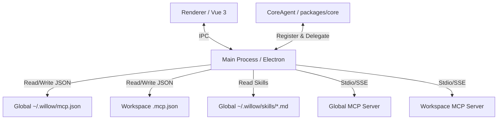

# Design: 支持 MCP 服务 与全局技能加载路径调整

## 1. 架构与路径概览

## 2. 存储设计

### 路径定义
- 全局主目录：`~/.willow`
- 全局 MCP 配置：`~/.willow/mcp.json`
- 全局技能加载目录：`~/.willow/skills`
- 工作空间 MCP 配置：`<workspacePath>/.mcp.json`

## 3. 全局技能加载逻辑更新

在 `packages/core/src/skills.ts` 中更新 `loadSkills` 函数：
- 将默认的全局技能加载路径 `agentDir` 锁定到 `join(homedir(), ".willow")`，不再依赖于传入的 `userData` 参数或 `.agents` 目录。
- 这样，用户全局配置的技能统一从 `~/.willow/skills` 中加载。

## 4. 主进程服务与生命周期

由 `McpServerService` 负责维护当前的活动 MCP 连接，按需建立/复用/重连。

## 5. 接口与 IPC

增加 MCP 服务的 CURD/Toggle 等 IPC 路由支持。
