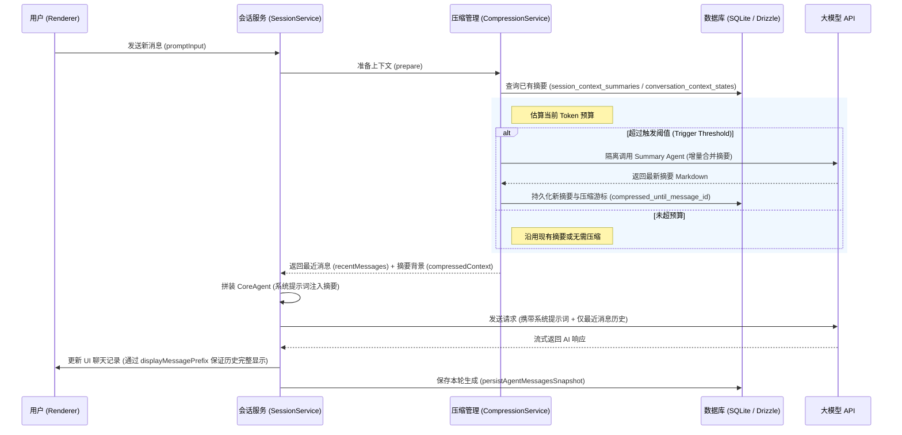

# Willow 桌面工作台：大模型上下文自动压缩与分层摘要系统设计（通关手册）

本篇文档深入剖析了 Willow 项目中**大模型上下文自动压缩（Context Compression）**的完整技术实现。旨在帮助你在中能够清晰、系统、具备深度地阐述该系统的设计背景、核心架构、双算法实现、核心预算算法、工程细节以及容灾降级机制。

---

## 一、 项目背景与痛点 (Background & Pain Points)

在 Willow 桌面工作台中，AI 助手（Agent）需要频繁地与用户的项目代码、任务列表（Todo）、搜索结果以及聊天历史进行交互。

- **上下文窗口膨胀（Token Context Bloat）**：随着会话轮次的增加，完整聊天历史的 Token 数量急剧膨胀，容易触发 LLM 的上下文上限（Context Window Limit）。
- **推理成本与延迟（Cost & Latency）**：将冗长且夹杂了大量历史细节、工具调用中间状态（如长段 bash 执行日志、文件读取内容）的全量历史重复发送给 LLM，会导致 API 消费成本高昂，且首字生成延迟（TTFT - Time to First Token）明显增大。
- **核心背景丢失问题**：如果简单地使用截断法（Truncation）丢弃早期历史，AI 将丧失之前的关键决策、已经做过的修改、未完成的待办事项以及用户明确表达过的习惯偏好，导致对话失去连续性。

---

## 二、 核心方案架构设计 (Architecture Design)

Willow 采用了 **增量摘要（LLM Summary） + 动态滑动窗口（Sliding Window）** 的混合方案，实现了对上下文的高效整理。

### 1. 核心设计原则

- **人机视口分离（双态保留）**：
  - **用户侧**：数据库中的 `session_messages` 始终保存完整的、未经破坏的用户可见聊天历史，用户在 UI 界面上看到的是无感知的连续对话。
  - **模型侧**：在将消息发送至 LLM 前，主进程在内存中动态截断历史消息，只保留最近的几轮交互，同时将早期历史的压缩摘要以只读背景的形式注入系统提示词（System Prompt）。
- **隔离的辅助摘要 Agent（Summary Agent Separation）**：
  - 压缩动作由一个**独立创建的轻量级摘要 Agent** 执行，而不是复用当前会话的主对话 Agent 实例。
  - **理由**：避免摘要请求污染主 Agent 的消息历史状态和工具执行流，且摘要 Agent **禁用任何工具**、**禁用推理模式（Reasoning）**，以最低的延迟和成本输出纯文本。

### 2. 系统拓扑图与处理流向

---

## 三、 双压缩算法对比：工程空间 vs. 对话空间

根据用户所在的工作空间性质不同，系统路由并调用两种完全不同的压缩算法与持久化策略：

| 对比维度               | 1. 工程空间压缩算法 (`ContextCompressionService`)                                                 | 2. 对话空间压缩算法 (`ConversationContextCompressionService`)                                     |
| :--------------------- | :------------------------------------------------------------------------------------------------ | :------------------------------------------------------------------------------------------------ |
| **适用场景**           | **Project Workspace（项目/工程模式）**。偏向具体研发、命令执行、复杂工程任务。                    | **Conversation Workspace（独立对话模式）**。偏向无明确代码库绑定的闲聊或跨项目的长期连续交流。    |
| **存储表结构**         | `session_context_summaries` 表                                                                    | `conversation_context_states` 表                                                                  |
| **核心存储字段**       | `summary` (摘要), `indexText` (索引提取)                                                          | `summary` (总摘要), `stableFacts` (长期事实), `openLoops` (未闭环事项)                            |
| **滑动窗口轮次**       | **保留轮次较多**：默认预估窗口 `preferredRecentRounds` 为 **5 轮**，预算紧张时最少缩至 **3 轮**。 | **保留轮次较少**：默认预估窗口 `preferredRecentRounds` 为 **4 轮**，预算紧张时最少缩至 **2 轮**。 |
| **模型推理开销**       | 对项目上下文敏感，保留更多技术背景。                                                              | 对会话流敏感，倾向于更紧凑的历史表示以让出输入带宽。                                              |
| **System Prompt 约束** | `contextSummarySystemPrompt`                                                                      | `conversationContextSystemPrompt`                                                                 |
| **核心输出格式**       | 结构化 Markdown，强约束包含 5 个二级标题（详见下方）。                                            | **三层上下文模型**：强约束包含 3 个二级标题（长期事实层、未闭环事项层、滚动摘要层）。             |

### 1. 工程空间压缩算法 (`ContextCompressionService`)

针对技术开发中高频调用的工具结果（如 `bash` 输出、文件 `read`）、编译错误和临时代码修改进行了适配，约束摘要必须为以下 Markdown 结构：

- `## 已压缩的历史摘要`：按时间顺序概括用户目标、约束和关键技术问题。
- `## 关键决策与事实`：列出仍会影响后续工程设计的技术方案、配置文件路径和版本选择。
- `## 已完成操作`：列出 Agent 已经完成的代码修改、功能部署和单元测试结论。
- `## 待跟进事项`：列出当前未解决、被阻塞、或用户指示稍后处理的待办工作。
- `## 索引`：用极其精简的行记录重要文件路径和任务标识，方便主 Agent 快速通过 RAG 定位。

### 2. 对话空间压缩算法 (`ConversationContextCompressionService`)

针对长期、无终结点的闲聊或日常指令流进行优化，其特点是强调用户的个性化约束与长线依赖，强制模型按以下**三层上下文模型**进行合并重写：

- `## 长期事实层`（长期有效事实）：记录用户的人设偏好、工程约束、常用习惯。除非用户明确变更，否则该层在合并中保持高度稳定，不可丢弃。
- `## 未闭环事项层`（未完结待办与疑问）：记录在之前的对话中提到但还没有最终闭环的待办事项、需二次确认的问题或开发验证项。
- `## 滚动摘要层`（渐进式摘要）：以极度凝练的文字概括历史对话的关键节点与演进结论，丢弃流水账式的交互细节。

---

## 四、 核心算法：上下文预算估算 (Context Budgeting)

这套机制的精髓在于 `app/work/src/main/utils/context-message-window.ts` 中的预算划分与动态裁剪算法。

### 1. Token 估算算法（Tokenizer Mock）

为了规避引入笨重的本地 Tokenizer 依赖（如 Tiktoken）导致的打包体积和跨平台编译问题，Willow 采用了一个**高效的字符估算函数**：

- **中文字符**：1 个字符约等于 1 个 Token。
- **ASCII 字符**：连续的 ASCII 字符通过除以 4 向上取整估算（约 4 字符 1 Token）。
- **JSON 消息开销**：对 `AgentMessage` 进行 `JSON.stringify` 转换并添加固定开销 `MESSAGE_OVERHEAD_TOKENS`（12 字节），保证对工具调用和元数据（Metadata）的保守估算。

### 2. 上下文预算细分 (Budget Calculation)

当传入当前模型的 `contextWindow`（如 64K / 128K）与 `maxTokens`（最大输出）时，计算如下：

- **保留输出空间 (Reserved Output)**：
  $$\text{reservedOutputTokens} = \min(\max(\text{maxTokens}, 1024), \text{contextWindow} \times 0.4)$$
  _目的：确保给模型预留足够的生成空间，防止输出被阶段性截断。_
- **可用输入空间 (Usable Context)**：
  $$\text{usableContext} = \text{contextWindow} - \text{reservedOutputTokens}$$
- **触发压缩阈值 (Trigger Threshold)**：可用输入空间的 **80%**。超出此值立即触发压缩。
- **压缩目标预算 (Target Budget)**：可用输入空间的 **60%**。压缩后最近消息窗口应缩小至此目标以内。

### 3. 动态滑动窗口裁剪算法

当判定需要压缩时，系统会执行以下裁剪逻辑：

1.  **按用户边界切分轮次 (Split by Rounds)**：
    - 将历史消息按 `User` 消息划分边界。一轮对话（Round）包含：一条 `User` 消息、其后的 `Assistant` 消息、以及该轮内产生的所有工具调用 `ToolCall` 和工具响应 `ToolResult`。
    - **理由**：避免在工具调用或思考链中间生硬截断，导致主 Agent 无法恢复当时上下文环境。
2.  **动态收缩最近窗口 (Dynamic Shrinking)**：
    - 根据工作空间类型，使用不同的最近轮次窗口边界收缩。
    - 计算保留这些轮次后的总输入 Token。如果总 Token 仍然大于**压缩目标预算 (Target Budget)**，则以一轮对话为单位，逐步向后丢弃较早的完整轮次，直到缩小到最低保留轮次（工程最少保留 3 轮，对话最少保留 2 轮）。
3.  **极致情况兜底 (Strict Limit Fallback)**：
    - 如果即使缩小到最低轮次，最近窗口仍然超过了模型的安全限制，则退化到**仅保留最后一轮消息**，并向外抛出降级原因为 `recent-window-too-large`。

---

## 五、 增量更新与持久化实现细节 (Implementation Details)

### 1. 增量摘要机制 (Incremental Updating)

系统不进行全量重复摘要，而是根据数据库中的 **压缩游标 (`compressed_until_message_id`)** 进行增量处理：

- 当触发压缩时，查询数据库表（`session_context_summaries` 或 `conversation_context_states`）中上一次压缩到的消息 ID。
- 找出从上一次游标之后，到当前划定的“最近消息窗口”起点之前的**新增未压缩消息**。
- **提示词模板**：
  将**旧摘要文本**（或者已存在的压缩上下文状态）与**新增历史段落**拼接在一起，要求 LLM 生成一份**全新的、合并后的紧凑摘要**。
  _这有效避免了摘要内容的简单堆叠，维持了摘要文本的恒定长度。_

### 2. DeepSeek 推理模型历史归一化 (DeepSeek Reasoning History Normalization)

- **痛点**：若使用 DeepSeek 推理模型（如 `deepseek-reasoning` / `r1`），其在多轮对话中要求必须回传前几轮 Assistant 输出的 `reasoning_content`（思考内容）。如果由于上下文裁剪导致消息格式损坏，或者在 OpenAI 兼容接口层降级为纯文本，后续请求会直接报 **400 BadRequest** 错误。
- **实现**：在 `agent.service.ts` 的 `normalizeDeepSeekReasoningHistory()` 函数中：
  如果目标模型是 DeepSeek，遍历所有经过裁剪后保留的 Assistant 历史消息。若其包含类型为 `thinking` 且 `thinkingSignature === "reasoning_content"` 的块，强制保持原有模型 ID，确保 `pi-ai` 适配层以原生的格式回传思考链，保障推理模型的稳定性。

### 3. 失败容灾与平滑降级 (Graceful Degradation)

- **兜底策略**：
  1.  **不中断对话**：摘要生成失败决不能阻塞用户发送新消息。设置 10 秒强超时限制。
  2.  **安全评估**：如果虽然摘要生成失败，但当前全量历史 Token 仍在模型安全的 `usableContext` 范围内，系统将放弃本次压缩，继续使用全量历史。
  3.  **极限降级**：若全量历史已超限，强制裁剪历史，只把最近窗口发给大模型，并在系统提示词中注入一段**固定的降级声明提示**，告知模型注意该状态。
  4.  **UI 反馈**：通过 IPC 向 Renderer 发送 `CONTEXT_COMPRESSION_UPDATED` 事件，利用 `vue-sonner` toast 警告用户：“较早历史可能不完整，AI 已优先保留最近上下文”。

### 4. 完美的 DB 事务控制与 UI 更新

- **消息快照保存**：在 `SessionService.persistAgentMessagesSnapshot` 中，如果本轮请求使用了压缩：
  1.  只从数据库中**删除**被替换掉的最近消息 IDs (`compression.replaceMessageIds`)。
  2.  **增量插入**大模型本轮响应产生的新消息。
  3.  **旧的被压缩消息不受影响**：因为它们不属于 `replaceMessageIds`，所以它们依然静静地留在 SQLite 中，使得 UI 重载时仍能完美渲染完整的聊天界面。

---

## 六、 模拟问答 (Mock Interview Questions)

### Q1: 你们项目中是如何解决 LLM 随着聊天进行 Context 爆掉问题的？

**参考回答**：

> 在我们项目中，我们设计并实现了一套**基于增量摘要和动态滑动窗口的上下文自动压缩机制**。
> 其核心是“**人机视口分离**”：我们在本地 SQLite 数据库中完整保存用户可见的所有消息，因此用户在 UI 上感觉不到消息丢失。但在主进程将请求发往 LLM 之前，我们做了一层动态网关过滤。
> 过滤网关会估算当前请求的 Token 预算。一旦超出可用输入空间的 80%，就会触发压缩：我们首先把历史消息按照 `User` 提问划分边界切分为“会话轮次”；然后保留最近几轮交互（项目空间保留 5 轮，对话空间保留 4 轮），将更早的历史送入一个**隔离的轻量摘要 Agent**。
> 摘要 Agent 会将新增历史与既有旧摘要合并生成 Markdown 结构的精炼背景信息。随后，我们把最近消息轮次作为对话历史，把合并后的摘要注入主 Agent 的 System Prompt 中。这样主 Agent 既能拥有完整的早期决策背景，又保持了最近的细节对话，同时也把 Token 消耗维持在极低的水平。

### Q2: 你们既然设计了两个上下文压缩算法服务，它们具体的异同和技术考量是什么？

**参考回答**：

> 我们区分了 **工程空间模式 (`ContextCompressionService`)** 和 **对话空间模式 (`ConversationContextCompressionService`)** 两种压缩算法：
>
> 1. **考量背景与业务侧重**：
>    - 工程空间侧重具体的任务解决，需要极度精确的代码变更历史、已执行成功的 shell 命令结论以及明确的技术决策。
>    - 对话空间则是一个长期的、跨项目的闲聊或头脑风暴空间，更侧重用户的个人偏好约束（如喜欢用TS、代码风格偏好等）以及待确认的开放性问题。
> 2. **数据模型差异**：
>    - 工程模式下的数据库表是 `session_context_summaries`，核心提取的是“已完成操作”、“待跟进事项”和“关键文件索引”。
>    - 对话模式下采用的是 `conversation_context_states` 表，它建立了一个 **“长期事实层、未闭环事项层、滚动摘要层” 的三层状态模型**。
> 3. **滑动窗口裁剪激进程度不同**：
>    - 工程模式需要更多的细节作为上下文，所以预留的最近对话轮次较多（默认 5 轮，最低 3 轮）。
>    - 对话模式需要更多的输入空间进行宽泛的主题讨论，所以裁剪更激进（默认 4 轮，最低 2 轮）。
>      这种多策略设计，可以根据用户的业务类型动态路由最适配的压缩模型，既保证了工程代码修改的精确性，又保证了日常闲聊的连续性。

### Q3: 增量摘要是怎么保证旧摘要不丢失重要细节，同时又不无限膨胀的？

**参考回答**：

> 这主要依赖于两点设计：**LLM Prompt 的强约束控制**，以及**分层结构化合并**。
>
> 1. 在摘要提示词中，我们约束摘要必须包含几个固定的 Markdown 二级标题（例如工程模式的5大标题，对话模式的三层分层）。
> 2. 进行增量压缩时，我们会将上一次保存在数据库中的**旧摘要正文**与**本次新增的待压缩消息**共同作为输入投喂给摘要 LLM。Prompt 会明确命令模型：“下面是既有摘要，请把它与新增历史合并为一份最新摘要，遇到重复的、过期的中间状态要进行丢弃，遇到最新、最稳定的偏好和事实要予以保留，严禁简单追加。”
> 3. 依靠大模型本身的语义提取能力，我们将“去重、整合、归档”这三个步骤交由 LLM 处理，使得输出始终收敛在一个紧凑、高度提炼的 Markdown 长度中。

### Q4: 如果涉及 reasoning 推理模型（如 DeepSeek R1 ），上下文裁剪和压缩会带来什么问题？你们是如何优化的？

**参考回答**：

> 这是一个非常典型的线上大模型对接踩坑经验。
> **痛点**：对于像 DeepSeek 这种推理模型，如果在之前的对话中大模型输出了带有思考链（`reasoning_content`）的消息，大模型在后面的请求中强制要求回传前几轮完整思考内容，且格式必须保持一致。如果我们在上下文压缩或滑动窗口阶段，生硬地丢弃了 Assistant 消息里的 `reasoning_content` 块，或者因为 OpenAI 兼容接口序列化错误丢失了这些属性，后续的 API 请求会直接返回 **400 BadRequest** 并报错崩溃。
> **解决手段**：
> 我们在裁剪后的消息进入模型前，加入了一层归一化函数 `normalizeDeepSeekReasoningHistory()`。它在检测到当前使用的是 DeepSeek 系列模型时，会深度扫描保留下来的最近历史消息。如果检测到包含 `thinkingSignature === "reasoning_content"` 的思考块，它会确保其包含原生模型标识并保持字段完整地送给 pi-ai 底层，防止降级为普通文本，从而在享受上下文压缩的同时，完美兼容了 DeepSeek R1 的推理稳定性。

---

_祝你顺利！_
