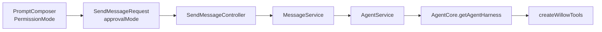
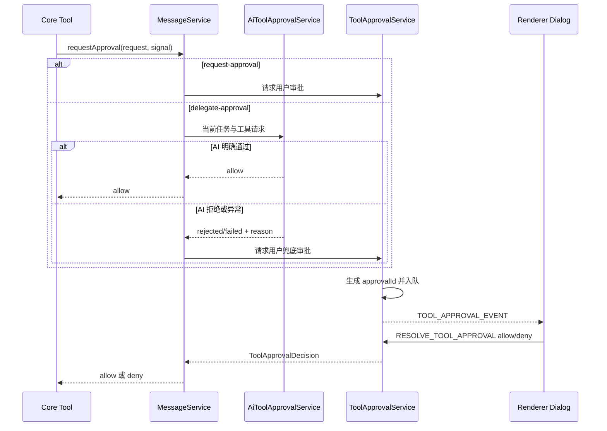

# Willow 工具权限设计

## 1. 文档目的

本文描述 Willow Agent 文件工具的权限模型、执行边界、审批链路和失败语义，作为后续扩展工具、
审查安全边界及排查审批问题的依据。

当前系统向 Agent 注册以下九个内置工具，其中 `websearch` 仅在外部传入 Tavily API Key 时注册：

- `bash`：执行 shell 命令；
- `read`：读取文本文件；
- `write`：创建或覆盖文件；
- `edit`：通过精确文本替换修改文件；
- `ls`：列出目录的直接子项；
- `grep`：搜索文件内容；
- `find`：按 glob 搜索文件。
- `webfetch`：抓取 HTTP/S 网页并转换为文本、Markdown 或 HTML。
- `websearch`：通过固定的 Tavily Search API 查询实时网络信息。

核心实现位于 [`packages/core/src/tools/`](../packages/core/src/tools/)，桌面应用的 AI 初审、用户审批
服务与界面位于
[`ai-tool-approval.service.ts`](../apps/work/src/main/service/ai-tool-approval.service.ts)、
[`tool-approval.service.ts`](../apps/work/src/main/service/tool-approval.service.ts) 和
[`ToolApprovalPanel.vue`](../apps/work/src/renderer/src/components/tool/ToolApprovalPanel.vue)。

## 2. 设计目标

权限系统遵循以下原则：

1. **默认最小权限**：未指定模式时使用 `request-approval`。
2. **沙箱优先**：非完全访问模式下，`bash` 通过 `@carderne/sandbox-runtime` 在 macOS
   `sandbox-exec` 中执行。
3. **读写边界明确**：文件工具和 shell 沙箱默认可读写当前工作区，以及由
   `AgentCore.agentDir` 解析出的全局 `skills` 目录（默认 `~/.willow/skills`），以支持管理
   自定义全局技能。由桌面应用传入的内置技能目录同样允许读写，以支持技能脚本在自身目录维护
   安装状态、缓存等运行资源。
4. **防止路径伪装**：工作区判断使用 canonical path，并检查最近存在的父目录，避免通过符号链接
   或尚未创建的路径绕过边界。
5. **单次授权**：AI 或用户批准只对当前工具调用有效，不产生会话白名单或永久规则。
6. **敏感写入硬拒绝**：`.env`、私钥等敏感模式在沙箱模式下不能通过普通审批放行。
7. **最小扩权**：shell 获批后只增加当前路径、域名或当前调用所需的 Apple Events 能力，并继续
   在沙箱中完整重跑。
8. **安全失败**：缺少审批回调、对话框关闭、任务中止或无效审批都按拒绝处理。
9. **模式按消息确定**：权限选择随每次发送消息传递，不持久化为工作区级策略。

## 3. 公共类型

权限公共类型由
[`packages/core/src/tools/types.ts`](../packages/core/src/tools/types.ts) 导出。

```ts
type PermissionMode =
  | "request-approval"
  | "delegate-approval"
  | "full-access";

type ToolApprovalDecision = "allow" | "deny";

type ToolApprovalReason =
  | "outside-workspace-read"
  | "outside-workspace-write"
  | "network-domain"
  | "application-launch"
  | "sandbox-denied";
```

审批请求结构如下：

```ts
type ToolApprovalRequest = {
  toolCallId: string;
  toolName: ToolName;
  input: Record<string, unknown>;
  reason: ToolApprovalReason;
  display: string;
  mayHavePartialEffects?: boolean;
};
```

字段含义：

| 字段 | 含义 |
| --- | --- |
| `toolCallId` | 将批准绑定到单个工具调用 |
| `toolName` | 发起请求的工具 |
| `input` | 原始工具参数，用于审计和界面展示 |
| `reason` | 需要额外权限的原因 |
| `display` | 面向用户显示的命令或路径 |
| `mayHavePartialEffects` | 首轮执行是否可能已经产生部分副作用 |

`AgentHarnessOptions` 接收 `permissionMode` 和异步 `requestApproval(request, signal)`。未提供
`requestApproval` 时，所有需要逃逸沙箱或写出工作区的操作都会被拒绝。

## 4. 三档权限模式

### 4.1 请求批准：`request-approval`

这是默认模式。

- `bash` 首先在沙箱中运行；
- `webfetch` 在每次网络请求前检查严格域名白名单，未允许域名先请求用户批准；
- `websearch` 仅访问已配置集成的固定域名 `api.tavily.com`，不逐次请求域名批准，但仍硬拒绝
  `deniedDomains` 中显式禁止的 Tavily 域名；
- 未允许的网络域名、可识别的写路径或结构化的应用启动能力被拒绝后，请求用户批准；
- 用户允许后，只把该域名、路径或 Apple Events 能力加入当前调用的临时授权，并在沙箱内完整
  重跑；
- `write/edit` 写入工作区外路径前请求批准；
- `read/ls/grep/find` 读取工作区外路径前请求批准；
- 敏感写入和无法映射到具体资源的 shell 拒绝不会提供裸跑逃逸；
- 用户拒绝、关闭审批框或中止任务都会终止当前工具调用。

批准只对当前 `toolCallId` 生效。

### 4.2 替我审批：`delegate-approval`

该模式保留与请求批准相同的初始安全边界，并使用设置中的小模型进行 AI 初审：

- `bash` 仍先在沙箱中执行；
- `webfetch` 仍在每次请求前执行域名检查，越界域名进入 AI 初审；
- `websearch` 沿用已配置集成的固定域名授权，不进入 AI 初审，并继续尊重显式域名拒绝；
- 可识别的沙箱资源拒绝、应用启动请求或 `write/edit` 准备写出工作区时，将当前用户消息、工具
  请求、越界原因和工作区路径发送给无工具的小模型；
- 只有严格、结构化的 AI `allow` 结果才直接放行；
- AI 拒绝、小模型未配置、调用失败、15 秒超时或输出无法解析时，转入用户审批；
- 用户可以拒绝或仅本次允许；任务已中止时直接拒绝，不再弹窗。

该模式的意义是让低风险且明确符合当前任务的逃逸由 AI 代为确认，同时对有风险或不确定的操作
保留用户最终决策。

### 4.3 完全访问权限：`full-access`

该模式不应用 Willow 的沙箱或工作区写入检查：

- `bash` 直接通过 `/bin/bash -lc` 执行；
- `webfetch` 跳过 Willow 域名策略和审批；
- `websearch` 跳过 Willow 域名策略，只受操作系统和 Tavily 服务端限制；
- `write/edit` 直接按目标路径写入；
- 不发起审批。

操作仍受操作系统当前进程权限、文件系统 ACL 和系统安全策略约束。

## 5. 权限决策矩阵

| 工具/行为 | 请求批准 | 替我审批 | 完全访问 |
| --- | --- | --- | --- |
| `bash` 可在沙箱内完成 | 沙箱执行 | 沙箱执行 | 直接执行 |
| `bash` 请求未允许域名 | 允许该域名后在沙箱内重跑 | AI 通过后按域名重跑，否则转用户审批 | 不经过沙箱 |
| `bash` 写入可识别的未允许路径 | 允许该路径后在沙箱内重跑 | AI 通过后按路径重跑，否则转用户审批 | 不经过沙箱 |
| `bash` 请求启动或控制外部应用 | 允许 Apple Events 后在沙箱内重跑 | AI 通过后按当前调用重跑，否则转用户审批 | 不经过沙箱 |
| `bash` 未知沙箱拒绝 | 失败，不提供裸跑 | 失败，不提供裸跑 | 不经过沙箱 |
| `webfetch` 请求允许域名 | 直接请求 | 直接请求 | 直接请求 |
| `webfetch` 请求未允许域名 | 请求前弹窗 | AI 通过后请求，否则转用户审批 | 直接请求 |
| `webfetch` 跨域重定向 | 逐跳授权 | 逐跳授权 | 直接跟随 |
| `webfetch` 请求拒绝域名 | 硬拒绝 | 硬拒绝 | 直接请求 |
| `websearch` 请求固定 Tavily 域名 | 配置 Key 后直接请求 | 配置 Key 后直接请求 | 直接请求 |
| `websearch` 命中拒绝域名 | 硬拒绝 | 硬拒绝 | 直接请求 |
| `write/edit` 工作区或全局技能目录内写入 | 直接执行 | 直接执行 | 直接执行 |
| `write/edit` 内置技能目录内写入 | 直接执行 | 直接执行 | 直接执行 |
| `write/edit` 工作区外写入 | 执行前弹窗 | AI 通过后写入，否则转用户审批 | 直接执行 |
| `write/edit` 敏感目标 | 硬拒绝 | 硬拒绝 | 直接执行 |
| `read/ls/grep/find` 工作区、全局或内置技能目录内读取 | 直接读取 | 直接读取 | 直接读取 |
| `read/ls/grep/find` 工作区外读取 | 执行前弹窗 | AI 通过后读取，否则转用户审批 | 直接读取 |
| 缺少审批回调 | 拒绝逃逸 | 拒绝逃逸 | 不需要回调 |
| 非 macOS 平台 | 创建任务失败 | 创建任务失败 | 可使用 |

> **只读边界说明**：`read`、`ls`、`grep` 和 `find` 在非完全访问模式下检查 canonical
> path。工作区外读取必须获得当前工具调用的一次性审批。

## 6. `bash` 沙箱设计

### 6.1 沙箱策略

非 `full-access` 模式通过 `@carderne/sandbox-runtime` 生成 macOS Seatbelt Profile，并启动
受控 HTTP/SOCKS 代理。基础策略为：

- 用户主目录默认禁止读取，再只读放行 canonical workspace、系统临时目录、由
  `AgentCore.agentDir` 解析出的全局 `skills` 目录（默认 `~/.willow/skills`）、由
  `AgentCoreOptions.builtinSkills` 指定的内置技能目录和明确配置路径；
- 写入只允许 canonical workspace、系统临时目录、全局 `skills` 目录、由
  `AgentCoreOptions.builtinSkills` 指定的内置技能目录和明确配置路径；
- `.env`、`.env.*`、`*.pem`、`*.key` 及 runtime mandatory deny 路径禁止写入；
- 网络采用域名 allowlist，未匹配域名由 runtime ask callback 报告并拒绝；
- Apple Events、浏览器进程能力、弱嵌套沙箱和弱网络隔离默认关闭；Apple Events 仅能通过当前
  bash 工具调用的一次性审批开启。

`SandboxManager` 是进程级单例，因此 Core 将沙箱初始化、命令执行和 reset 串行化，防止并发
Harness 的工作区策略互相覆盖。

`AgentCore` 将实例字段 `agentDir` 传入工具运行时。相对路径按用户主目录解析，绝对路径保持其
绝对位置，沙箱再在解析后的全局 Agent 目录下追加 `skills`。桌面应用传入的内置技能目录会同时
合并到 `SandboxPolicy.allowRead` 和 `SandboxPolicy.allowWrite`；Core 不在沙箱实现中重复写死
应用资源路径。

### 6.2 资源拒绝与沙箱内重跑

网络代理 callback 会返回未允许的具体 host。shell 重定向错误和 macOS violation monitor 用于
提取被拒绝的具体写路径。violation monitor 还会识别 `lsopen`、`appleevent-send` 以及
LaunchServices/Apple Events 的固定 Mach 服务拒绝。识别到资源或应用启动能力后：

1. 域名构造 `reason: "network-domain"`，写路径构造
   `reason: "outside-workspace-write"`，应用启动构造 `reason: "application-launch"`；
2. 设置 `mayHavePartialEffects: true`；
3. 按当前权限模式进入用户审批或 AI 初审；
4. 获准后只将该 host、canonical path 或 Apple Events 能力加入当前 `toolCallId` 的内存授权；
5. reset 并按扩展后的策略重新初始化 runtime；
6. 在新的沙箱中完整重跑原始命令。

Apple Events 是 macOS 提供给 `open` 和 `osascript` 的共同能力，因此审批文案明确说明它可以
启动或控制外部应用。Core 不解析 shell，也不根据可伪造的 stdout/stderr 文案授予该能力；只有
结构化 violation 可以触发审批。授权后浏览器进程能力仍保持关闭，文件和网络策略不变。

无法识别为具体资源或能力的拒绝作为普通命令错误返回，不再提供脱离沙箱重跑。单个命令最多处理
16 次资源扩权，防止重定向或恶意命令产生无限审批循环。

### 6.3 输出、超时与中止

- stdout 和 stderr 合并并流式发送工具更新；
- 返回内容保留最后 2000 行或 50KB；
- 截断时完整输出写入临时目录，并通过 `fullOutputPath` 返回；
- `timeout` 必须为正有限秒数；
- 超时或 `AbortSignal` 触发时终止整个进程组；
- 非零退出码作为工具错误返回。

路径提取仍包含输出文本启发式。如果系统返回未覆盖的新拒绝文案，该命令会安全失败，而不会
降级为非沙箱执行。

## 7. 文件写入权限

### 7.1 工作区判断

`write` 和 `edit` 在非完全访问模式下调用
[`authorizeMutation`](../packages/core/src/tools/shared.ts)。

在工作区和额外 `allowWrite` 判断之前，Core 检查敏感写入模式。命中 `.env`、`.env.*`、
`*.pem`、`*.key` 或额外 `denyWrite` 时直接失败，不调用审批回调。`full-access` 明确跳过该
限制。

判断流程：

1. 将相对路径解析为基于工作区的绝对路径；
2. 从目标开始向父目录回溯，找到最近存在的路径；
3. 对该路径执行 `realpath`，解析符号链接；
4. 将尚未存在的剩余路径重新附加到 canonical parent；
5. 将结果与工作区的 canonical path 比较。

只有目标位于工作区 canonical path、由 `agentDir` 解析出的全局 `skills` 目录或显式
`allowWrite` 根内时，才允许无提示写入。内置技能目录由 `AgentCore` 合并到 `allowWrite`。

这同时覆盖：

- `../` 路径逃逸；
- 绝对路径写出工作区；
- 工作区内符号链接指向外部目录；
- 目标尚未创建，但最近存在的父目录位于工作区外。

全局技能目录沿用相同的 canonical path 判断，目录内指向外部位置的符号链接不会获得写权限。
`.env`、私钥等敏感写入模式也会同时应用于工作区和全局技能目录。

### 7.2 写入时序

工作区外写入的审批发生在创建目录、读取待编辑文件或写入内容之前，因此拒绝不会产生目标文件
副作用。

同一路径上的 `write/edit` 通过进程内 mutation queue 串行执行，避免并发工具调用相互覆盖。
该队列只保证单个 Willow 进程内、按解析后绝对路径的串行性，不提供跨进程锁或文件事务。

### 7.3 `edit` 的完整性约束

`edit` 仅执行满足下列条件的替换：

- `oldText` 非空；
- 每个 `oldText` 在原文件中只出现一次；
- 多个替换区间不重叠。

编辑保留 UTF-8 BOM 和原文件换行风格，并在 details 中返回 unified diff、增加行数和删除行数。
这些约束属于数据完整性保护，不替代权限检查。

## 8. 只读工具边界

`read`、`ls`、`grep` 和 `find` 在非完全访问模式下调用 `authorizeRead()`：

1. 解析目标文件、目录或搜索根；
2. 通过最近存在父目录和 `realpath()` 得到 canonical path；
3. 工作区、由 `agentDir` 解析出的全局 `skills` 目录、内置技能目录、`allowRead` 或
   `allowWrite` 根内直接读取；
4. 其他路径构造 `outside-workspace-read` 审批；
5. 获批只允许当前工具调用继续，不保存规则。

- `read` 按 UTF-8 文本读取，支持行偏移和行数限制；
- `ls` 只列出直接子项；
- `grep/find` 默认跳过 `.git` 和 `node_modules`；
- `grep/find` 尊重搜索根目录中的 `.gitignore`；
- 显式将根目录设为 `.git` 或 `node_modules` 时允许搜索；
- `grep` 跳过包含 NUL 字节的二进制文件；
- 搜索与读取仍支持 `AbortSignal` 和统一输出截断。

全局技能目录使用与其他允许根相同的 canonical path 比较，因此该目录内指向外部位置的符号链接
仍视为越界读取并要求单次审批。`.gitignore` 只影响搜索结果，不是安全边界，也不阻止显式
`read`。

### 8.1 `webfetch` 网络边界

`webfetch` 不通过 shell 沙箱执行，因此在发送每一个请求前直接应用 `SandboxPolicy`：

1. 使用标准 `URL` 解析并将 hostname 规范化为小写精确值；
2. `deniedDomains` 优先，命中时硬拒绝；
3. `allowedDomains` 或当前工具调用已批准域名直接放行；
4. 其他域名构造 `network-domain` 审批；
5. 获批域名只加入当前 `toolCallId` 的内存集合。

HTTP URL 会在访问前升级为 HTTPS。工具关闭自动重定向并最多手动跟随 10 跳，每个新目标在请求前
重复上述授权流程；重定向审批设置 `mayHavePartialEffects: true`，因为前序请求已经发出。
`full-access` 跳过该域名授权，但仍执行 URL、120 秒超时、10 跳重定向和 5MB 响应限制。

### 8.2 `websearch` 网络边界

`websearch` 是显式配置的固定服务集成，只在 `AgentCoreOptions.tavilyApiKey` 为非空时注册。工具
仅向 `https://api.tavily.com/search` 发送查询，不接受 URL、域名或请求头参数，API Key 只进入
Bearer Authorization Header，不写入工具输出、details、会话或日志。

保存 Tavily API Key 表示用户授权 Willow 使用该固定服务，因此 `request-approval` 和
`delegate-approval` 不为每次搜索重复弹出域名审批。两种沙箱模式仍检查
`SandboxPolicy.deniedDomains`，显式拒绝 `api.tavily.com` 时在发出请求前硬拒绝；`full-access`
与其他工具一致跳过该策略。搜索保留参数校验、25 秒超时、AbortSignal 和稳定 HTTP 错误语义。

## 9. 端到端权限传递

权限模式由 renderer 的 Prompt Composer 选择，并随当前消息传递：



关键语义：

- `SendMessageRequest.approvalMode` 为可选字段，用于兼容旧调用方；
- `MessageService` 对缺失值应用 `request-approval` 默认值；
- 模式在创建本次消息对应的 Agent Harness 时固定；
- renderer 会保留当前选择供下一条消息使用，但不会写入工作区配置。

## 10. 审批生命周期

### 10.1 主进程审批服务

`MessageService` 负责决定当前请求进入用户审批还是 AI 初审。`delegate-approval` 调用
`AiToolApprovalService`，使用用户配置的 `smallModel` 和独立内存会话；模型无工具且
`thinkingLevel` 为 `off`。AI 输入是结构化 JSON，输出必须严格为：

```json
{"decision":"allow","reason":"简短安全理由"}
```

只有合法的 `allow` 自动通过。AI 拒绝或异常时，`ToolApprovalService` 为用户审批生成随机 UUID
`approvalId`，并维护：

- `pending`：等待结果的审批项；
- `queue`：审批顺序；
- `activeApprovalId`：当前唯一展示的审批。

审批按 FIFO 串行展示。一个审批完成后才派发下一个，避免多个模态框同时竞争。同一会话的
`requested` 和 `decided` custom entry 也通过独立的持久化队列串行追加，避免并发工具审批以同一
parent 写成不同 session branch。



审批事件包含 `workspaceId` 和 `sessionId`。renderer 只处理与当前页面匹配的请求。

### 10.2 用户决策

`request-approval` 总是显示审批框；`delegate-approval` 仅在 AI 拒绝或异常时显示，并附带 AI
结论和简短理由。用户操作为：

- **拒绝**：当前工具调用失败；
- **仅本次允许**：只允许当前审批对应的工具调用；
- **关闭对话框**：等同拒绝。

无效、已完成或已中止的 `approvalId` 返回 `resolved: false`，不能被重复使用。
审批正常完成或因任务中止而自动拒绝时，主进程会广播对应 `approvalId` 的结算事件；renderer
仅在事件仍匹配当前面板时清除它，避免并发请求的新面板被旧事件覆盖。若 renderer 错过事件后
提交了已失效请求，也会清除该陈旧面板并等待会话历史或后续实时事件恢复当前审批。

### 10.3 中止与清理

停止任务时，`MessageService` 调用 `harness.abort()`。对应 `AbortSignal` 会：

- 终止正在运行的 shell 进程组；
- 使文件和搜索工具在下一中止检查点失败；
- 将等待中的审批自动结算为 `deny`；
- 从 `pending`、审批队列和 active 状态中移除等待项；
- 继续派发队列中的下一项。

拒绝、关闭对话框、中止和正常决策都会移除 signal listener，避免遗留等待项。

### 10.4 未决审批恢复

`ToolApprovalService` 在派发用户审批事件前，先向当前 session branch 追加
`willow.tool-approval` custom entry。`requested` entry 保存审批展示信息以及恢复所需的模型、
权限模式和原用户消息；审批完成或任务中止后追加对应的 `decided` entry。

读取消息历史时，主进程按 branch 顺序重放这些 entry，并将最早的未决审批作为
`pendingToolApproval` 返回。renderer 按 `workspaceId + sessionId` 隔离审批状态，在进入对应会话
时恢复审批面板。历史请求开始后如果收到更新的实时审批事件，renderer 不允许较旧的历史响应覆盖
该事件。

客户端重启后，原审批 Promise 和 Agent Harness 已不存在。用户提交决定时，`MessageService`
使用已保存的模型、权限模式和 session metadata 重建 Harness：

- 验证审批并写入 `decided` entry 后立即返回，renderer 随即关闭审批面板；
- 拒绝时为原 `toolCallId` 追加错误 tool result，再继续生成后续回复；
- 允许时重新执行原工具输入，只对匹配的 `toolCallId` 和工具名称消费一次该决定；
- 恢复期间产生的其他越界请求仍进入正常审批流程；
- 工具重放和 Agent 续跑作为会话后台任务执行，状态通过原消息事件流反馈。

当前 `@earendil-works/pi-agent-core@0.80.6` 的 `AgentHarness` 没有公开无新用户消息的续跑方法。
仓库通过 pnpm 补丁增加 `continue()`，内部复用依赖已有的 `runAgentLoopContinue`，并保持
Harness 的事件派发、会话写入、中止及 busy 状态语义。

同一会话出现多个未决审批时，持久化恢复顺序与运行时 FIFO 队列一致；提交决定时按
`approvalId` 精确匹配，不能使用其他会话或其他工具调用的审批。

## 11. 错误与安全失败语义

| 场景 | 结果 |
| --- | --- |
| 默认模式未传入 | 使用 `request-approval` |
| 非完全访问模式没有 handler | 安全拒绝 |
| AI 明确返回合法 `allow` | 当前调用直接放行 |
| AI 拒绝、未配置、失败、超时或无效输出 | 转用户审批 |
| AI 审批期间任务中止 | 直接拒绝，不弹用户审批框 |
| 用户拒绝 | 工具抛出权限拒绝错误 |
| 对话框关闭 | 按拒绝处理 |
| 审批等待期间停止任务 | 自动拒绝并释放队列 |
| 重复提交 approvalId | 返回未解析，不重复授权 |
| 非 macOS 使用沙箱模式 | 创建 Agent Harness 时明确报错 |
| `full-access` 在非 macOS | 正常创建，受系统进程权限约束 |
| shell 超时或中止 | 终止进程组并返回错误 |
| shell 非零退出且非沙箱拒绝 | 作为普通命令错误返回 |

## 12. 信任边界与非目标

当前权限系统提供的是 Willow 进程内的工具执行策略，不是完整的主机安全容器。

明确的非目标和限制：

- 不分析 shell AST，也不在执行前预测命令需要哪些权限；
- 不为单个 shell 子命令授权；资源获批后仍会完整重跑整条命令；
- Apple Events 获批后对当前工具调用中的完整命令生效，不能限制为只执行 `open`；它也能支持
  `osascript` 控制外部应用，因此必须作为独立能力明确展示；
- 不提供永久白名单、会话规则或“始终允许”；
- 不提供跨进程文件锁、回滚或事务；
- `full-access` 不绕过操作系统权限；
- `webfetch` 的应用层域名授权不是独立主机容器；显式允许的 IP 字面量按普通 hostname 访问；
- 当前沙箱模式仅支持 macOS，未实现 Linux namespace/seccomp 或 Windows sandbox；
- 首轮沙箱命令和扩权后沙箱重跑之间不具备原子性。
- AI 审批是保守的辅助判断，不构成独立安全边界；用户仍可覆盖 AI 拒绝。
- AI 只接收当前用户消息和当前工具请求，不接收完整会话历史。

新增工具时必须先判断其属于只读、工作区内写入还是潜在沙箱逃逸，并显式接入相应的授权入口，
不能仅依靠 UI 文案表达权限。

内置工具通过 `ToolBase` 统一保证参数校验先于权限校验、权限校验先于执行。只读工具在基类权限
钩子中调用 `authorizeRead()`，文件修改工具调用 `authorizeMutation()`；需要在执行期发现具体
逃逸资源的 `bash` 通过基类的单次审批辅助方法调用同一 `authorize()` 契约。基类不会吞掉权限
拒绝或执行错误，所有失败仍以异常形式交给 Agent Runtime 标记为错误工具结果。

## 13. 测试要求

权限相关变更至少应覆盖：

1. 三种模式下的 `bash` 与 `webfetch` 执行矩阵；
2. 域名、写路径和应用启动能力获批后仅扩展当前调用，并在沙箱内重跑；
3. 未知沙箱拒绝不会触发通用审批或裸跑；
4. 工作区内、工作区外和符号链接逃逸的读写；
5. 敏感写入硬拒绝以及 `full-access` 的显式绕过；
6. 缺失审批 handler 时的安全拒绝；
7. 非 macOS 平台行为；
8. 审批 FIFO、一次性 resolution 和 AbortSignal 清理；
9. AI 严格 JSON、未配置、失败、超时、无效输出和 AbortSignal；
10. 对话框权限原因、AI 理由、allow、deny 和关闭行为；
11. 停止任务时 shell、AI 调用、工具和审批等待项的释放；
12. 真实 macOS runtime 对读取、写入、域名 allowlist 和 Apple Events 默认关闭的限制。
13. `webfetch` 初始请求和跨域重定向逐跳授权、格式转换、大小限制、超时和中止。
14. `websearch` 的条件注册、固定域名拒绝、Bearer 鉴权、参数校验、响应解析、超时、中止和密钥
    不泄漏。

Core 测试位于
[`packages/core/test/tools.test.ts`](../packages/core/test/tools.test.ts) 和
[`packages/core/test/webfetch.test.ts`](../packages/core/test/webfetch.test.ts)、
[`packages/core/test/websearch.test.ts`](../packages/core/test/websearch.test.ts)，主进程审批测试位于
[`apps/work/test/tool-approval.test.ts`](../apps/work/test/tool-approval.test.ts)。

## 14. 后续演进建议

如果未来需要提高隔离强度，建议按以下顺序演进：

1. 将剩余 shell 路径拒绝识别完全升级为结构化 violation 事件；
2. 为 Linux 和 Windows 启用并验证 runtime 的平台 adapter；
3. 将 shell 执行器和 sandbox adapter 显式注入，降低平台测试成本；
4. 增加审批超时和主进程退出时的统一清理；
5. 在保持单次授权默认值的前提下，设计可审计的会话级规则。
